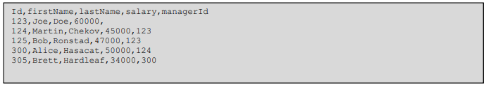

<H1>Project Description:</H1>
BIG COMPANY is employing a lot of employees. Company would like to analyze its organizational
structure and identify potential improvements. Board wants to make sure that every manager earns
at least 20% more than the average salary of its direct subordinates, but no more than 50% more
than that average. Company wants to avoid too long reporting lines, therefore we would like to
identify all employees which have more than 4 managers between them and the CEO.
You are given a CSV file which contains information about all the employees. File structure looks like
this:
Each line represents an employee (CEO included). CEO has no manager specified. Number of rows
can be up to 1000.

Write a simple program which will read the file and report:
- which managers earn less than they should, and by how much
- which managers earn more than they should, and by how much
- which employees have a reporting line which is too long, and by how much
  
<H1>Classes:</H1>
- <b>FillEmployeeService:</b> this class is responsible for reading lines from a file
- <b>GenerateCSVFileService:</b> this class is responsible for generate file with records
- <b>HierarchyDepthService:</b> this class is responsible for found all managers for employee 
- <b>SalaryDifferentFoundService:</b> this class is responsible for found salary deviations
- <b>PropertiesUtil:</b> this unit class is responsible for get properties needed for working application  
- <b>Runner:</b> this class contains the main method